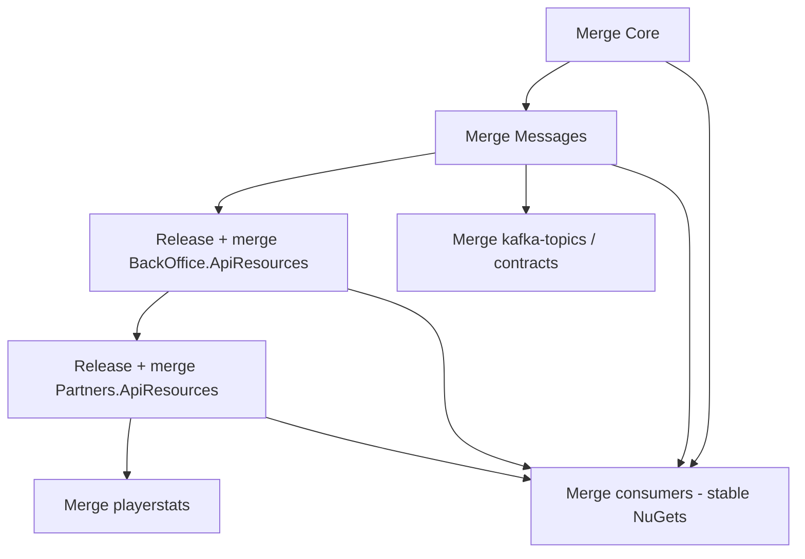
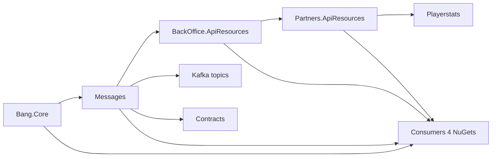

# Add new game type (CORE)

## Use when

The user adds a **new live game type** across CORE services (not qa-tests-v2 slots — see `add-new-slot-game`).

## Required inputs

Ask before starting if missing:

| Input | Example |
|-------|---------|
| Jira ticket | `CORE-3980` |
| Game id / `GameType` | `bac-bo` / `BacBo` |
| Closest reference game | Sic Bo, Roulette, … |
| Scope | consumers to include/skip (default: [reference.md](reference.md) list) |

## Global rules

- **Phase order is strict** — do not start phase *N+1* until phase *N* gate passes.
- **Git:** `git fetch` + update base branch (`develop` or `main`/`master` per repo) before a feature branch.
- **Commits:** `CORE-{ticket}: Short message` (colon after key).
- **No commit or push** unless the user explicitly approves in the **current** message (see global `no-git-commit-push-without-approval` rule).
- **Do not** bump consumer repos unless the user asked for that phase or scope.
- **Do not** scan all of `~/repos/` for package references — use the [phase 8 list](reference.md) unless the user explicitly asks for a full scan.

## Phase checklist

Copy and update as you go:

```
- [ ] 1. Core (Bang.Core) — MR / merge / feed
- [ ] 2. Messages — after Core in feed
- [ ] 3. Backoffice + ApiResources snapshot → merge → release (drop snapshot)
- [ ] 4. Partners + Partners ApiResources snapshot → merge → release (drop snapshot)
- [ ] 5. Playerstats — after Partners.ApiResources in feed; rebase develop; release refs
- [ ] 6. Kafka topics (core only)
- [ ] 7. Contracts
- [ ] 8a. Consumers — snapshot bumps (integration testing only, if user asks)
- [ ] 8b. Consumers — release refs after phases 3–4 merged
- [ ] Pre-merge: all producing packages + consumers on non-snapshot versions
```

---

## Snapshot vs release versions

**During development** use snapshots on packages whose **sources** change. **Before merge** drop the snapshot suffix on producing repos, then point all consumers at the **stable** versions.

| Stage | Who bumps `<Version>` | Version format | Who consumes |
|-------|----------------------|----------------|--------------|
| Feature WIP | `Bang.BackOffice.ApiResources`, `Bang.Partners.ApiResources` | `{next}-snapshot-core-{ticket}-{n}` | Feature branches via NuGet snapshot from feed |
| ApiResources re-edit | Same producing project | Increment `-n` (e.g. `-1` → `-2`) | Re-publish snapshot; consumers pick up new snapshot only if their `.csproj` is updated |
| **Pre-merge (required)** | Backoffice, then Partners | **Drop** `-snapshot-core-{ticket}-{n}` → plain semver (e.g. `7.12.4`, `18.16.9`) | Partners references **stable** `BackOffice.ApiResources`; playerstats/consumers reference both stable ApiResources |
| Post-merge consumers | Consumer repos only (no `<Version>` bump) | Stable refs in `PackageReference` | `feature/CORE-{ticket}-bump-nugets` → merge |

**Rules:**

- Snapshots are for **integration before merge** — not for merging to `develop`/`master`.
- Only the project that **builds** the package sets `<Version>`. Consumers set `PackageReference Version="..."`.
- When backoffice merges, consumers still on `7.12.2-snapshot-…` are **stale** — align to the **released** backoffice version (CORE-3980: `7.12.4`).
- `Bang.Core` and `Bang.Common.Messages` use **normal semver** (no snapshot suffix in this workflow).
- **Do not commit or push** snapshot→release changes unless the user explicitly approves.

Details and CORE-3980 example versions: [reference.md](reference.md#snapshot-lifecycle).

---

## MR merge order

Merge **in dependency order**. Later MRs must reference packages already **merged and published** at **stable** versions.

| Order | Repo / MR | Branch | Blocked until |
|-------|-----------|--------|---------------|
| 1 | **core** — `Bang.Core` | `develop` | — |
| 2 | **messages** — `Bang.Common.Messages` | `develop` | `Bang.Core` merged + in feed |
| 3 | **backoffice** — service + `Bang.BackOffice.ApiResources` | `feature/CORE-{ticket}-add-{game}-game-type` | Core (+ Messages if used); **drop snapshot on ApiResources before merge** |
| 4 | **partners** — service + `Bang.Partners.ApiResources` | `feature/CORE-{ticket}-add-{game}-game-type` | `BackOffice.ApiResources` **stable** in feed; **drop Partners snapshot before merge** |
| 5 | **playerstats** | `feature/CORE-{ticket}-add-{game}-game-type` | `Partners.ApiResources` **stable** in feed; rebase `develop` before merge |
| 6 | **kafka-topics** | `main` | Topics defined (often after messages/backoffice) |
| 7 | **contracts** | `master` | Schema changes ready |
| 8 | **Consumers** (parimatch, hub88, …) | `feature/CORE-{ticket}-bump-nugets` | Producing packages merged at **stable** versions; consumer `.csproj` uses release refs only |

**Can run in parallel** (after their dependencies exist): kafka-topics + contracts; qa-tests-v2 (`add-new-game-type-autotests`); consumer snapshot bumps for core-qa **before** final merge wave.

**Pre-merge sweep** (when user says “preparing to merge all MRs”):

1. Backoffice: `Bang.BackOffice.ApiResources` snapshot → release; commit, merge.
2. Partners: `Bang.Partners.ApiResources` snapshot → release; `Bang.BackOffice.ApiResources` → stable; commit, merge.
3. Playerstats: rebase `develop`; `BackOffice` + `Partners` + `Bang.Core` → stable; commit, merge.
4. All consumers: replace any `*-snapshot-core-{ticket}-*` with stable versions; rebase `develop`; commit, merge.



---

## Phase 1 — Core (`Bang.Core`)

**Repo:** `wnf3/bang/core/core` → local `core`, branch **`develop`**.

1. Add `GameType` (and related core enums/contracts used by all services).
2. Bump **`Bang.Core`** package version in the core repo; open MR to `develop`.
3. **Gate:** stop until **`Bang.Core` is published** to the NuGet feed at the new version.
   - Ask the user to confirm feed availability (or verify via pipeline/release if the team has a standard check).
   - **Do not start phase 2** until this gate passes.

---

## Phase 2 — Messages (`Bang.Common.Messages`)

**Repo:** `wnf3/bang/core/common/messages` → local `common/messages`, branch **`develop`**.

**Start only after phase 1 gate.**

1. Reference the **published** `Bang.Core` version from phase 1.
2. Add message types / topic payloads / enums needed for the new game.
3. Bump **`Bang.Common.Messages`** version; MR to `develop`, merge, publish.
4. **Gate:** `Bang.Common.Messages` new version in feed before backoffice work that depends on it.

---

## Phase 3 — Backoffice

**Repo:** `wnf3/bang/core/backoffice` → local `backoffice`, branch **`develop`**.

**Depends on:** published `Bang.Core`, `Bang.Common.Messages` (as needed by the service).

1. Implement game in backoffice (mirror reference game — see [reference.md](reference.md)).
2. **`Bang.BackOffice.ApiResources`:** if any file under `src/Bang.BackOffice.ApiResources/` changes, bump package `<Version>` to a **snapshot** (e.g. `7.12.4-snapshot-core-{ticket}-1`; increment `-n` on further ApiResources edits).
3. Backoffice service may use **ProjectReference** to ApiResources on the feature branch; consumers will use the **NuGet** snapshot after publish.
4. **Before merge:** remove snapshot suffix → release semver (e.g. `7.12.4`). See [Snapshot vs release](#snapshot-vs-release-versions).
5. MR `feature/CORE-{ticket}-add-{game}-game-type` (or team convention).
6. **Gate:** **`Bang.BackOffice.ApiResources`** **stable** version in feed before partners merge.

---

## Phase 4 — Partners

**Repo:** `wnf3/bang/core/partners` → local `partners`, branch **`develop`**.

**Start only after `Bang.BackOffice.ApiResources` is in the feed** at the version partners should reference.

1. Game-specific partners changes.
2. Bump **`Bang.Partners.ApiResources`** snapshot when ApiResources **sources** change (same snapshot naming pattern, ticket in suffix).
3. Reference published **`Bang.BackOffice.ApiResources`** **stable** version in partners `.csproj` (update from snapshot when backoffice merges).
4. **Before merge:** remove Partners snapshot suffix → release semver (e.g. `18.16.9`).
5. MR + publish Partners ApiResources at stable version.
6. **Gate:** **`Bang.Partners.ApiResources`** **stable** in feed before playerstats merge.

---

## Phase 5 — Playerstats

**Repo:** `wnf3/bang/core/playerstats` → local `playerstats`, branch **`develop`**.

**Start only after `Bang.Partners.ApiResources` is in the feed.**

1. Implement playerstats support for the new game (often NuGet-only for live games — see [reference.md](reference.md#playerstats-phase-5)).
2. Rebase onto **`develop`** before merge.
3. Reference **stable** packages: `Bang.Partners.ApiResources`, `Bang.BackOffice.ApiResources`, `Bang.Core` (versions from merged phases 1–4).
4. MR on `feature/CORE-{ticket}-add-{game}-game-type` (or team convention).

---

## Phase 6 — Kafka topics

**Repo:** `wnf3/shared-infra/kafka-topics` → local `kafka-topics`, branch **`main`**.

1. Add **core** topics for the game (producers/consumers defined in earlier phases).
2. **Do not** add lobby topics unless the user explicitly requests lobby scope.
3. MR to `main`.

Can run in parallel with 4–5 only if the user accepts risk; default order is after messages/backoffice definitions are stable.

---

## Phase 7 — Contracts

**Repo:** `wnf3/bang/core/contracts` → local `contracts`, branch **`master`** (confirm with user).

1. Update shared contracts (Avro/OpenAPI/etc.) for the new game.
2. MR to `master`.

---

## Phase 8 — Consumer NuGet bumps (four packages)

**When to run:**

| Mode | When |
|------|------|
| **Default** | After **all four** packages are merged and published as **non-snapshot** stable versions |
| **Snapshot** | Only when the user **explicitly** asks to bump consumers to snapshot versions (e.g. core-qa integration **before** merge wave) |
| **Release (pre-merge)** | User preparing to merge all MRs — replace every `*-snapshot-core-{ticket}-*` with stable versions in all consumer `.csproj` files |

**Packages:** up to four — `Bang.Core`, `Bang.BackOffice.ApiResources`, `Bang.Common.Messages`, `Bang.Partners.ApiResources`. Bump **only** packages already referenced in that service’s `.csproj` (see [reference.md](reference.md) per-repo column).

- **Default integration consumers** (parimatch, hub88, softswiss, promo-balance-service, public-api-v1, slots-adapter, wagercraft-adapter): all four when present.
- **`preferences`:** **`Bang.Partners.ApiResources` only** — do **not** add or bump `Bang.Common.Messages` (or Core / BackOffice.ApiResources).

**Repos:** fixed list in [reference.md](reference.md). Skip fusemedia/betconstruct/wearecasino/tables unless the user includes them.

**Per repo workflow:**

```bash
cd ~/repos/{service}
git fetch origin
git checkout develop && git pull origin develop
git checkout -b feature/CORE-{ticket}-bump-nugets   # or reset existing branch onto develop
# edit .csproj — bump only PackageReferences listed for that repo in reference.md
```

- One commit per repo: `CORE-{ticket}: Bump {game} NuGet packages` or `CORE-{ticket}: Bump BackOffice.ApiResources to {game} snapshot`.
- Resolve **merge conflicts** with `develop` locally; **do not push** until the user approves.
- After rebase, `git push --force-with-lease` only if the user explicitly says push.

**Do not** update all consumers when the user only asked to change backoffice or a single phase.

---

## Publish order (summary)



Stable consumer bumps (phase 8 default) happen after merges; snapshot consumer bumps only on **explicit** user request.

---

## MCP

Use **GitLab MCP** for MR status, conflicts, and file diffs. If `get_merge_request_conflicts` returns 404, use `get_merge_request` + `get_branch_diffs` + local `git rebase origin/develop`.

---

## Additional resources

- Repo paths, consumer list, snapshot pattern: [reference.md](reference.md)
- **qa-tests-v2 API autotests** (optional, parallel): `add-new-game-type-autotests` skill — user-supplied Allure IDs required
- Ignored integration projects: global rule `ignore-projects.mdc`
- Release audit of touched services: `core-release-diff-audit` skill
